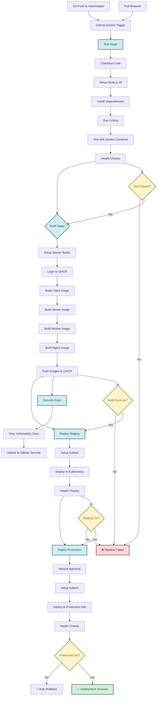
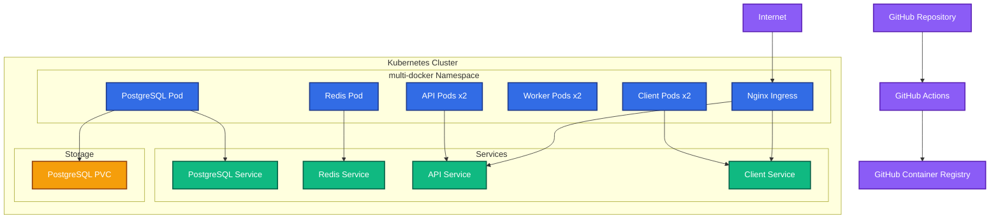
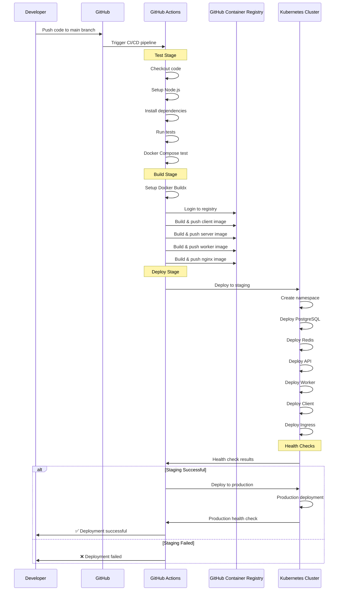
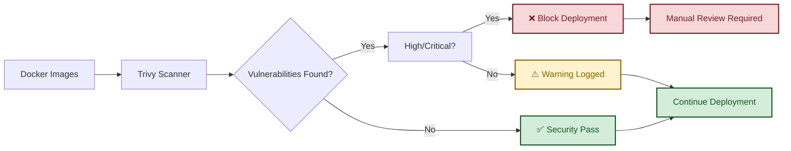

# CI/CD Pipeline Visual Diagram

## 🚀 Complete CI/CD Pipeline Flow

## 🏗️ Infrastructure Architecture

## 🔄 Deployment Flow

## 🛡️ Security Pipeline

## 📊 Monitoring & Observability

```mermaid
graph TB
    subgraph "Application Metrics"
        A[API Response Time]
        B[Worker Processing Time]
        C[Database Connections]
        D[Redis Cache Hit Rate]
    end
    
    subgraph "Infrastructure Metrics"
        E[CPU Usage]
        F[Memory Usage]
        G[Disk I/O]
        H[Network Traffic]
    end
    
    subgraph "Health Checks"
        I[Liveness Probes]
        J[Readiness Probes]
        K[Startup Probes]
    end
    
    subgraph "Logging"
        L[Application Logs]
        M[Access Logs]
        N[Error Logs]
    end
    
    subgraph "Alerts"
        O[High CPU Alert]
        P[Memory Pressure Alert]
        Q[Service Down Alert]
        R[Error Rate Alert]
    end
    
    A --> O
    B --> P
    C --> Q
    D --> R
    
    E --> O
    F --> P
    G --> Q
    H --> R
    
    I --> Q
    J --> Q
    K --> Q
    
    L --> R
    M --> R
    N --> R
```

## 🎯 Key Features Highlighted

### ✅ **Automated Testing**
- Unit tests and linting
- Docker Compose integration tests
- Health checks for all services

### ✅ **Multi-Stage Builds**
- Optimized Docker images
- Security scanning
- GitHub Container Registry

### ✅ **Kubernetes Deployment**
- Rolling updates
- Health checks
- Auto-scaling capabilities
- Resource management

### ✅ **Security & Monitoring**
- Vulnerability scanning
- Health monitoring
- Automated rollback
- Comprehensive logging

### ✅ **Environment Management**
- Staging environment
- Production environment
- Environment-specific configurations
- Secrets management 