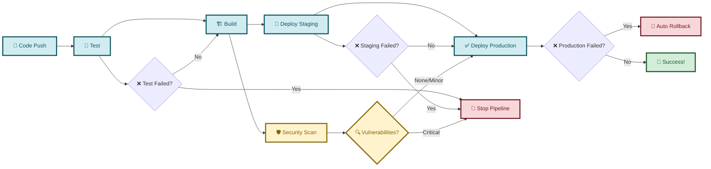
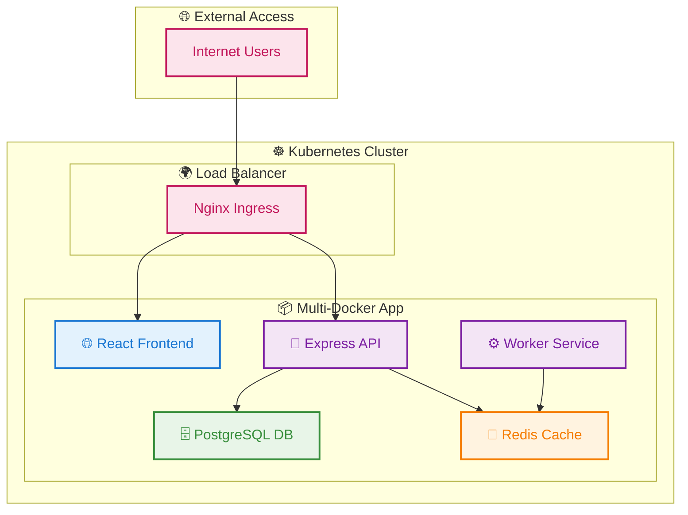
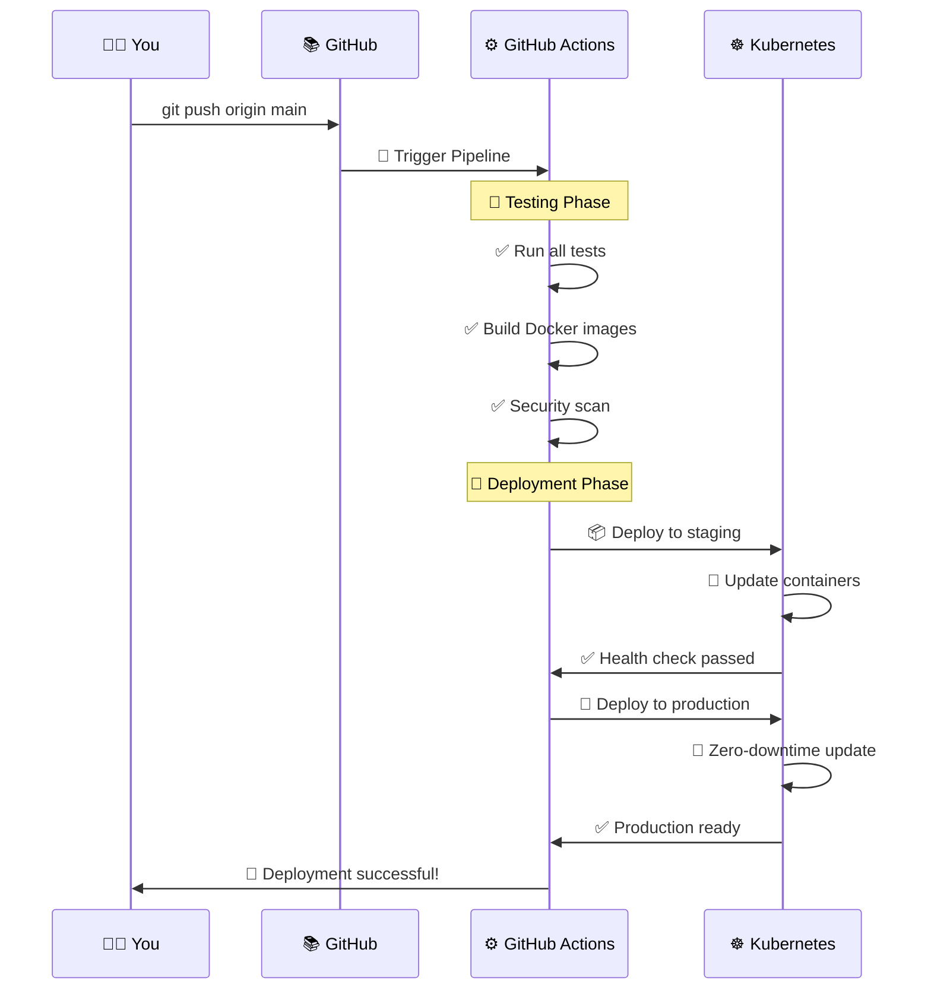
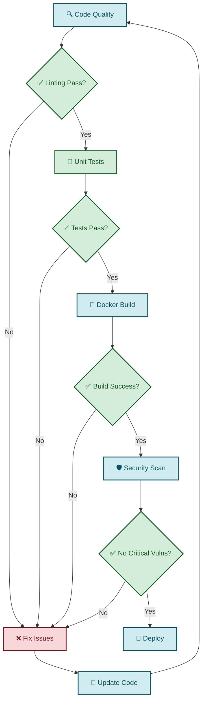

# Simple CI/CD Pipeline Overview

## 🚀 High-Level Pipeline Flow

## 🏗️ Application Architecture

## 🔄 What Happens When You Push Code

## 🛡️ Security & Quality Gates

## 📊 Key Benefits

### ⚡ **Speed**
- Automated testing saves hours
- Parallel builds for faster deployment
- Zero-downtime updates

### 🛡️ **Safety**
- Multiple quality gates
- Security scanning
- Automatic rollback on failure

### 🔄 **Reliability**
- Health checks at every stage
- Staging environment testing
- Production monitoring

### 📈 **Scalability**
- Kubernetes auto-scaling
- Load balancing
- Resource management

## 🎯 Quick Start

1. **Push code** to main branch
2. **Watch pipeline** in GitHub Actions
3. **Monitor deployment** in Kubernetes
4. **Access application** at your domain

That's it! 🎉 